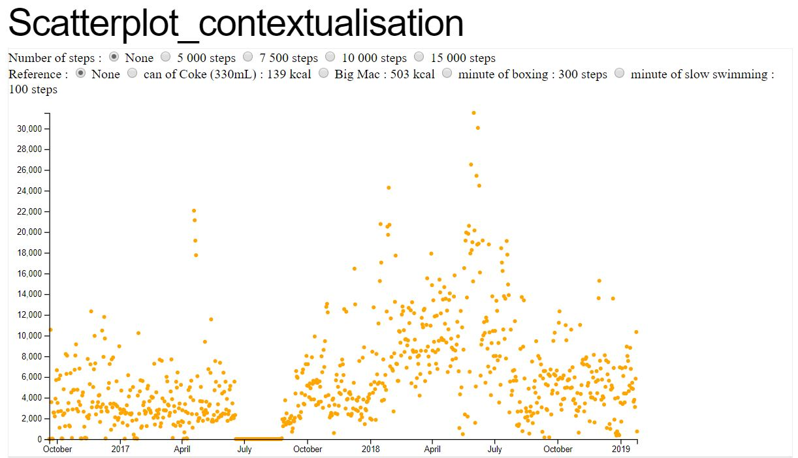

# PasAPas
Pas A Pas 
(Projet de Data Vizualisation MOS5.5)
  Sandrine DUPREZ, Céline DUPLAY, Léa GAUTILLOT

## Idée projet et problématique

* Nous souhaiterions étudier les données sur la santé et les déplacements que nous pouvons retrouver sur nos téléphones comme le nombre de pas ou encore les distances parcourues afin de mettre en évidence plusieurs comportements : journée type travail / week-end / vacances/ saisons. 

* Nous pourrions ainsi essayer d’identifier s’il est possible de repérer un schéma ou si, au contraire, il n’est pas possible de mettre en avant un comportement régulier. 

## Données personnelles dont nous aurons besoin

* Nombre de pas au quotidien
* Distances parcourues

## Questions auxquelles nous souhaitons répondre

* Peut-on, à l’aide du nombre de pas par heure, mettre en évidence certains types de comportements ? (travail, week-end, vacances)
* Si oui, quelles sont les caractéristiques de ces comportements ? 
* Le sujet étudié marche-t-il “assez” par jour ? (contextualisation des données)
* La saison a-t-elle une influence sur la marche ? (faible température, forte température)

## Comment les collecter ? 

Extraction depuis les applications mobiles (santé sur IOS) : fichiers xml récupérés et fichier csv via l’application QS Access.

## Quels sont les risques pour la collecte/visualisation ? (règles, éthique etc)

* Sans être un risque, l’un des enjeux sous-jacent est celui de la santé
* Données liées à la santé donc potentiellement sensibles, privées/ à caractère personnel → anonymisation des données
* Sécurité d’accès des données : qui peut y avoir accès ?
* Niveau de précision des outils de mesures non connu 
        
    
 ## Premières visualisations 
 
 * Sur tableau :
        https://public.tableau.com/views/HealthData_22/Comparaisonavecrecommandations?:embed=y&:display_count=yes&publish=yes
        
 * Sur d3 : 
        https://bl.ocks.org/celine-d/ed0134c25cde81f3295a126c1e5f74ce/4539862c4f31c9d29b9c5fa36d5522ecbaceec63
        https://bl.ocks.org/lgautill/aad8bb2ad61124e0134753073fb392c6/882852a7da76896e025d876d180c902f055bd561
        
 * Exemple ci-dessous:
  
        
        
 ## Crédits
 
 Contenu Bootstrap
   Cours de visualisation 2018 : https://github.com/LyonDataViz/MOS5.5-Dataviz
