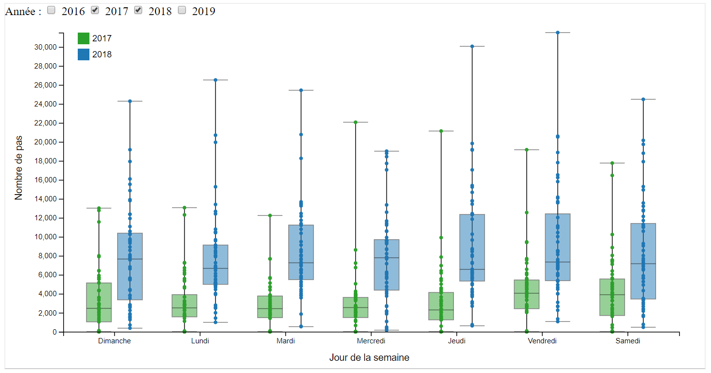
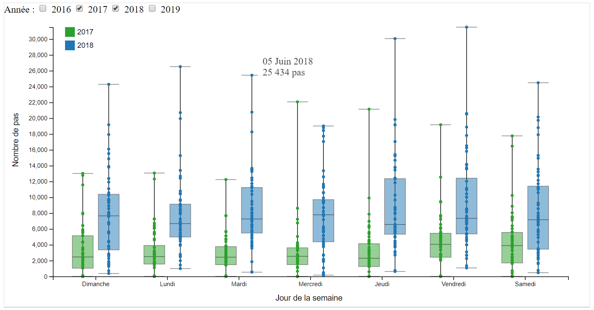
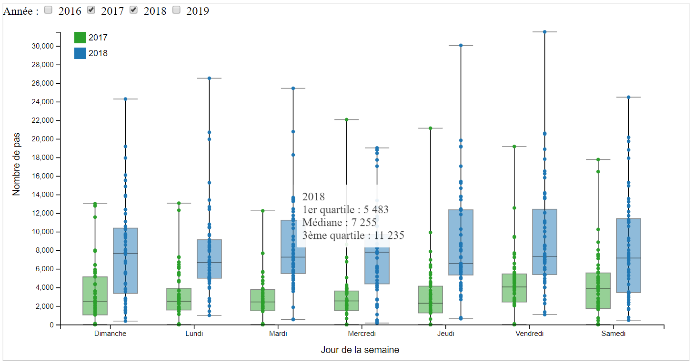
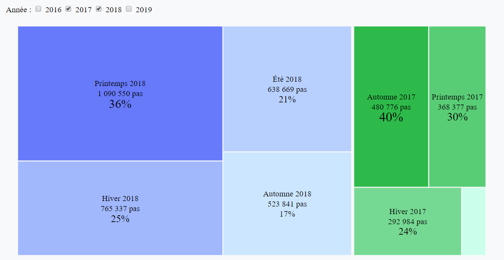

# PasAPas
Pas A Pas 
(Projet de Data Visualization MOS5.5)
  Sandrine DUPREZ, Céline DUPLAY, Léa GAUTILLOT

## Idée projet et problématique

* Nous souhaiterions étudier les données sur la santé et les déplacements que nous pouvons retrouver sur nos téléphones comme le nombre de pas ou encore les distances parcourues afin de mettre en évidence plusieurs comportements : journée type travail / week-end / vacances/ saisons. 

* Nous pourrions ainsi essayer d’identifier s’il est possible de repérer un schéma ou si, au contraire, il n’est pas possible de mettre en avant un comportement régulier. 

## Données personnelles dont nous aurons besoin

* Nombre de pas au quotidien
* Distances parcourues

## Questions auxquelles nous souhaitons répondre

* Peut-on, à l’aide du nombre de pas par heure, mettre en évidence certains types de comportements ? (travail, week-end, vacances)
* Si oui, quelles sont les caractéristiques de ces comportements ? 
* Le sujet étudié marche-t-il “assez” par jour ? (contextualisation des données)
* La saison a-t-elle une influence sur la marche ? (faible température, forte température)

## Comment les collecter ? 

Extraction depuis les applications mobiles (santé sur IOS) : fichiers xml récupérés et fichier csv via l’application QS Access.

## Quels sont les risques pour la collecte/visualisation ? (règles, éthique etc)

* Sans être un risque, l’un des enjeux sous-jacent est celui de la santé
* Données liées à la santé donc potentiellement sensibles, privées/ à caractère personnel → anonymisation des données
* Sécurité d’accès des données : qui peut y avoir accès ?
* Niveau de précision des outils de mesures non connu 
        
    
 ## Premières visualisations 
 
 * Sur tableau :
        https://public.tableau.com/views/HealthData_22/Comparaisonavecrecommandations?:embed=y&:display_count=yes&publish=yes
        
 * Sur d3 : 
        https://bl.ocks.org/celine-d/ed0134c25cde81f3295a126c1e5f74ce/4539862c4f31c9d29b9c5fa36d5522ecbaceec63
        https://bl.ocks.org/lgautill/aad8bb2ad61124e0134753073fb392c6/882852a7da76896e025d876d180c902f055bd561
  
 ## Visualisations 
 
 * Liens :
 
 Scatterplot : contextualisation des données en calories brûlées et exercices
 
 https://bl.ocks.org/lgautill/eb7ab63ab7ca6e039bfb407d923e1de5/a349d98a6123246acd443aba351fed420e810963
 
 Barchart : contextualisation des données en distances parcourues
 
 https://bl.ocks.org/lgautill/11c29ff7ec20da675782c9a3f757b4d1/0356a8e1482453b128c61c2e6fe65933a90a2182
 
 Boxplot : influence du jour de la semaine sur le nombre de pas
 
 https://bl.ocks.org/sduprez/3b5cd439025e7b86fc6b5695e69572d4/78d2d9e36c24526f47ccbcae8c73af7167010323
 
 Treemap : influence de la saison sur le nombre de pas
 
 https://bl.ocks.org/sduprez/0ef524b8af8cc0ad70c3a6338662ab3e/d55755739cd6b1d166fbe93f61877d381ed981be
 
 * Descriptions des visualisations et de leurs caractéristiques :
 
 <b>Scatterplot : contextualisation des données en calories brûlées et exercices</b>
 
 Cette visualisation représente le nombre de pas effectués en fonction de la date. 
 Tout d'abord, en haut, il est possible de cocher les années que l'utilisateur souhaite voir apparaître. Ici, sur l'exemple, ce sont 2017 et 2018. 
  
  
Cette visualisation permet surtout de contextualiser les données. En premier, après "nombre de pas :", l'utilisateur peut cocher le nombre de pas référence qu'il souhaite. Ainsi, les points changent de couleur et sont en rouge si le nombre de pas est inférieur à la référence cochée et en vert s'il est supérieur. Ici, sur l'exemple le nombre de pas coché est de 7 500 pas correspondant à une personne modérément active.  
  
  
Enfin, la visualisation permet également de choisir une référence. Cette référence peut être de deux types, calorique : nombre de Big Mac ou de Coca-Cola éliminés ou sportive : nombre de minutes de boxe ou de nage lente réalisées. Les points apparaissent alors avec un diamètre plus ou moins important en fonction du résultat. En passant la souris sur les points, des informations supplémentaires s'affichent. Ici, on peut voir la référence en canettes de Coca-Cola et que le 7 Juin 2018, la personne a effectué 30 060 pas (ce qui est bien supérieur à 5 000 pas donc en vert) et éliminé 7,6 canettes de Coca-Cola.  
 
  
 <b>Barchart : contextualisation des données en distances parcourues</b>
  
Cette visualisation permet à l'utilisateur de connaître la distance qu'il a parcourue sur un mois et de la comparer à trois distances connues : Lyon-Saint-Étienne , Lyon-Clermont-Ferrand et Lyon-Montpellier. Tout d'abord, l'utilisateur peut choisir les années qu'il souhaite visualiser. De plus, par défaut, la distance référence est Lyon-Saint-Étienne. Ici, sur l'exemple ci-dessous toutes les années ont été cochées.
  
  
Sur cette exemple la distance référence est Lyon-Clermont-Ferrand. L'axe des abscisses a été modifié. De plus, en positionnant sa souris sur une barre, l'utilisateur a accès à des informations plus précises. Ici, en Octobre 2017, 148 km ont été parcourus ce qui correspond à 0,9 fois la distance Lyon-Clermont-Ferrand. 
  
  
Sur cette exemple la distance référence est Lyon-Montpellier. On peut observer qu'en Avril 2017, 99 km ont été parcourus ce qui correspond à 0,3 fois la distance Lyon-Montpellier. 
  
  
<b>Boxplot : influence du jour de la semaine sur le nombre de pas</b>

Cette visualisation permet de voir le nombre de pas effectués selon le jour de la semaine, afin de voir s'il existe un lien entre les deux. Il est possible de cocher les années que l’on souhaite visualiser grâce aux checkbox situées en haut à gauche (2017 et 2018 sur l’exemple ci-dessous).

Chaque point représente le nombre de pas effectués pour une date particulière. Les points sont positionnés sur l'axe des abscisses selon le jour de la semaine correspondant, et la couleur de chaque point représente l'année. (ci-dessus, vert pour 2017 et bleu pour 2018).
Il est possible de connaître plus précisément le nombre de pas et la date liés à un point en passant la souris sur celui-ci. Sur l'exemple ci-dessous, le point représentant le nombre de pas le plus élevé pour un mardi de 2018 est le 5 juin 2018.

Le principe du boxplot est également de tracer des rectangles permettant de connaître la distribution statistiques des données : le haut du rectangle représente le 3ème quartile, le bas du rectangle représente le 1er quartile, et le milieu du rectangle représente la médiane. Il est possible de connaître ces données plus précisément en passant la souris sur le rectangle concerné, comme sur l'exemple ci-dessous : pour les mardis de l'année 2018, le nombre de pas médian est 7 255, et on sait que pour 75% des jours concernés, plus de 5 483 pas ont été effectués, et pour seulement 25% des jours concernés, le nombre de pas dépasse 11 235.

Cette visualisation permet donc de repérer si on a tendance à marcher plus certains jours de la semaine. Sur l'exemple ci-dessus, on peut voir que le nombre de pas est globalement plus élevé en fin de semaine. Elle permet aussi de mettre en évidence des dates particulières pour lesquelles le nombre de pas a été particulièrement important. Enfin, elle permet de visualiser une tendance globale selon les années : ici on voit que le nombre de pas effectués a été en général plus important en 2018 qu'en 2017, et ce pour chaque jour de la semaine. 

<b>Treemap : influence de la saison sur le nombre de pas</b>

Cette visualisation a pour but de voir si la saison de l’année a un impact sur le nombre de pas effectués. Il est possible de cocher les années que l’on souhaite visualiser grâce aux checkbox situées en haut à gauche (2017 et 2018 sur l’exemple ci-dessous).
  

Les rectangles d’une même gamme de couleur représentent une même année, puis chaque rectangle au sein de ce groupe représente une saison de cette année. Les rectangles sont organisés par année puis par saison selon un ordre décroissant du nombre de pas : les blocs contenant le plus de pas sont situés en haut à gauche. L’intensité de la couleur varie selon le nombre de pas effectués. Dans chaque rectangle, on peut lire les informations suivantes : saison, année, nombre de pas. On affiche également un pourcentage, qui correspond au rapport entre le nombre de pas effectués sur la saison concernée et l’année complète. Par exemple, 36% des pas de l’année 2018 ont été effectués au printemps.  

Cette visualisation permet donc de repérer rapidement l’année pendant laquelle le plus de pas ont été effectués (2018 ici), et pour chaque année, la saison pendant laquelle le plus de pas ont été effectués (Printemps pour 2018 et Automne pour 2017). Les pourcentages permettent de comparer les données de plusieurs années entre elles en remettant à l’échelle : par exemple, le printemps représente 36% des pas pour 2018, et 30% des pas pour 2017.

 * Notre site:
 https://celine-d.github.io/PasAPas/
        
        
 ## Crédits
 
 Contenu Bootstrap
   Cours de visualisation 2018 : https://github.com/LyonDataViz/MOS5.5-Dataviz
   Références de marche: http://www.fitmania.fr/10-000-pas-par-jour-pour-rester-en-forme/    https://www.sciencepresse.qc.ca/actualite/detecteur-rumeurs/2017/09/20/marcher-10-000-jour-pour-tenir-forme-vrai
